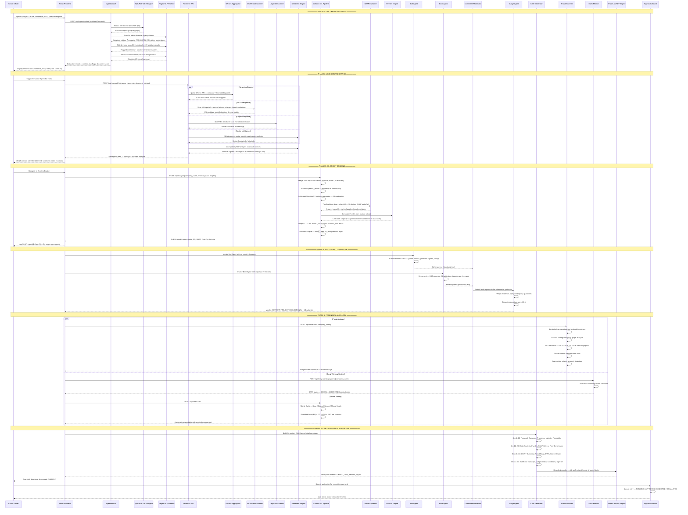

# KRED — Know Your Credits

<div align="center">


[](https://python.org)
[](https://fastapi.tiangolo.com)
[](https://react.dev)
[](https://typescriptlang.org)
[](https://xgboost.readthedocs.io)
[](https://shap.readthedocs.io)
[](LICENSE)

**Enterprise-grade AI-powered credit intelligence platform for Indian financial institutions.**  
*Multi-agent deliberation · XGBoost ML scoring · Real-time OSINT · Forensic fraud detection · Automated CAM generation*

[Live Demo](#getting-started) · [Architecture](#system-architecture) · [API Docs](#api-reference) · [Contributing](#contributing)

</div>

---

## Table of Contents

1. [Overview](#overview)
2. [Core Capabilities](#core-capabilities)
3. [System Architecture](#system-architecture)
4. [Agent Workflow](#agent-workflow)
5. [ML Scoring Engine](#ml-scoring-engine)
6. [Tech Stack](#tech-stack)
7. [Getting Started](#getting-started)
8. [API Reference](#api-reference)
9. [Module Documentation](#module-documentation)
10. [Security](#security)
11. [Contributing](#contributing)

---

## Overview

**KRED** (Know Your Credits) is a next-generation, AI-native credit underwriting intelligence platform purpose-built for Indian lending institutions — NBFCs, PSU banks, private banks, and fintech lenders. It combines a multi-agent LLM deliberation engine with a production-grade XGBoost credit scoring pipeline, real-time OSINT research, forensic fraud analytics, and automated Credit Appraisal Memo (CAM) generation — processing a full credit appraisal in under **60 seconds**, compared to the traditional 3–5 day turnaround.

> **"From document upload to signed CAM in under a minute. KRED isn't just fast — it's a paradigm shift in credit underwriting."**

### Why KRED?

| Traditional Underwriting | KRED |
|---|---|
| 3–5 business days | < 60 seconds end-to-end |
| Manual document review | AI-powered OCR + NLP extraction |
| Analyst intuition-based | XGBoost ML + SHAP explainability |
| Single analyst opinion | Multi-agent Bull/Bear/Judge deliberation |
| Manual OSINT research | Live OSINT: news + MCA + legal + sector feeds |
| No fraud detection | Benford's Law + Circular Trading + Benami scan |
| 30–40 page manual CAM | Auto-generated 34-section CAM PDF |
| No stress testing | Monte Carlo 4-scenario stress engine |
| No early warning | Automated EWS + CRILC cross-check |

---

## Core Capabilities

### 🧠 Multi-Agent AI Credit Committee
A three-agent adversarial deliberation engine simulates a real credit committee. The **Bull Agent** builds the investment case; the **Bear Agent** stress-tests every assumption; the **Judge Agent** synthesizes both perspectives and delivers a calibrated APPROVE/REJECT/CONDITIONAL verdict with full rationale — eliminating single-analyst bias entirely.

### 📊 XGBoost Credit Scoring Engine
A production-trained XGBoost gradient boosting classifier trained on **5,000+ synthetic Indian corporate credit records** across 5 company profiles (Excellent, Good, Marginal, Poor, Distressed). The engine outputs:
- **CIBIL-style 300–900 credit score** with grade mapping (AAA → CCC)
- **Probability of Default (PD)** calibrated via isotonic regression
- **SHAP waterfall** — 20-feature explainability for every decision
- **Five Cs framework** — Character, Capacity, Capital, Collateral, Conditions (each scored 0–100)
- **Decision package** — suggested credit limit, interest rate, risk premium in basis points

### 🔍 Live OSINT Research Engine
Real-time multi-source intelligence gathering across:
- **News feeds** — financial press, regulatory announcements, sector alerts
- **MCA portal** — annual return filings, board resolutions, charge registrations
- **Legal records** — NCLT/IBC proceedings, arbitration awards, court orders
- **Sector intelligence** — RBI circulars, industry cost trends, peer comparisons

Dual-polarity analysis produces **Positive Signals** and **Risk Signals** with a composite **Sentiment Score (0–100)**.

### 🚨 Forensic Fraud Detection
A 5-vector forensic scanner running simultaneously:
1. **Benford's Law Deviation** — statistical detection of revenue/invoice fabrication
2. **Circular Trading Score** — inter-party transaction pattern analysis
3. **ITC Mismatch Analysis** — GSTR-2A vs GSTR-3B discrepancy fingerprinting
4. **Round-Amount Concentration** — shell entity transaction pattern recognition
5. **Transaction Velocity Anomaly** — sudden throughput spikes indicating stress

### 📄 34-Section CAM Auto-Generator
Produces a fully structured Credit Appraisal Memo matching RBI-prescribed formats in PDF. Covers proposal details, promoter background, financial ratio analysis, peer benchmarking, Five Cs assessment, risk mitigants, committee debate transcript, and final verdict — all in a single automated pipeline.

### 📈 Monte Carlo Stress Engine
Four-scenario stress simulation (Base / Stress / Severe / Macro Shock) with Expected Loss (EL) calculations under AIRB methodology, portfolio survival assessment, and PD/LGD sensitivity tables.

### ⚠️ Early Warning System (EWS)
Automated monitoring pipeline scanning for 12 leading stress indicators across financial, operational, and behavioral dimensions — triggering escalation workflows before default crystallises.

---

## System Architecture

```mermaid
graph TB
    subgraph "Client Layer"
        B[Browser / React 19 SPA]
        V[Vite 6 Build Engine]
        TW[Tailwind CSS v4]
    end

    subgraph "Frontend Application"
        LP[Landing Page<br/>Mode Selector]
        DB[Dashboard<br/>Session Hub]
        ING[Ingestor<br/>Document Upload]
        RSR[Research Agent<br/>OSINT Console]
        DD[Due Diligence<br/>Checklist Engine]
        SCR[Scoring Engine<br/>ML Visualiser]
        FRD[Forensic Lab<br/>Fraud Scanner]
        RES[Results Engine<br/>CAM Viewer]
        APP[Approvals Board<br/>Committee Queue]
        DNA[Risk DNA<br/>Entity Profiler]
        TK[TickerTape<br/>Live Market Feed]
    end

    subgraph "API Gateway"
        FAS[FastAPI v0.110<br/>ASGI Server]
        CORS[CORS Middleware]
        RR[Request Router]
        VAL[Pydantic v2<br/>Schema Validation]
    end

    subgraph "Ingestion Pipeline"
        OCR[PyMuPDF<br/>PDF Text Extractor]
        RGX[Regex NLP Engine<br/>40+ Indian Financial Patterns]
        ENT[Entity Extractor<br/>PAN · GSTIN · CIN · Amounts · Dates]
        RKW[Risk Keyword Scanner<br/>30 Risk Signals · 20 Positive Signals]
        FIN[Financial Term Indexer<br/>30 Accounting Metrics]
    end

    subgraph "OSINT Research Engine"
        GN[GNews API Connector<br/>Multi-source News Aggregator]
        MCA[MCA Portal Scraper<br/>Annual Returns · Charges]
        LEG[Legal DB Scanner<br/>NCLT · IBC · Arbitration]
        SEC[Sector Intelligence Feed<br/>RBI Circulars · Industry Reports]
        SEN[Sentiment Analyser<br/>Bull / Bear Signal Extraction]
    end

    subgraph "Agentic Intelligence Layer"
        BAG[Bull Agent<br/>Investment Case Builder]
        BEAG[Bear Agent<br/>Risk Stress Tester]
        JAG[Judge Agent<br/>Adversarial Synthesiser]
        CMD[Credit Committee<br/>Moderator Protocol]
        VRD[Verdict Engine<br/>APPROVE · REJECT · CONDITIONAL]
    end

    subgraph "LLM Engine"
        PHI[Microsoft Phi-4-mini-reasoning<br/>GitHub Model Marketplace]
        MST[Mistral Ministral-3B<br/>Fast Inference Engine]
        CTX[Context Window Manager<br/>Token Budget Tracker]
        PRO[Prompt Orchestra<br/>38-template Prompt Library]
    end

    subgraph "ML Scoring Pipeline"
        XGB[XGBoost Classifier<br/>5,000-sample Training Set]
        CAL[CalibratedClassifierCV<br/>Isotonic Regression PD Calibration]
        SHAP[SHAP TreeExplainer<br/>20-feature Waterfall Analysis]
        FIV[Five Cs Calculator<br/>Character · Capacity · Capital · Collateral · Conditions]
        SCK[Score Bucketer<br/>300–900 CIBIL-style Output]
        DEC[Decision Engine<br/>Limit · Rate · Risk Premium]
        CV[StratifiedKFold<br/>5-fold Cross Validation]
    end

    subgraph "Forensic Risk Layer"
        BNF[Benford Law Analyser<br/>First-Digit Distribution Test]
        CIR[Circular Trading Detector<br/>Inter-party Flow Graph]
        ITC[ITC Mismatch Scanner<br/>GSTR-2A vs 3B Delta]
        RND[Round Amount Screener<br/>Concentration Pattern Detector]
        VEL[Velocity Monitor<br/>Transaction Spike Detector]
        FSC[Fraud Score Aggregator<br/>Weighted Risk Index]
    end

    subgraph "Ancillary Risk Engines"
        EWS[Early Warning System<br/>12-indicator Stress Monitor]
        CRL[CRILC Cross-check<br/>Reported Default Database]
        STR[Monte Carlo Stress Engine<br/>4-scenario EL Calculator]
        BMK[Sector Benchmarker<br/>Peer Ratio Comparison]
        PIE[Primary Insight Engine<br/>Field Officer Intelligence]
    end

    subgraph "CAM Generation Engine"
        CAM[34-Section CAM Builder<br/>RBI-format Structured Output]
        RPT[ReportLab PDF Renderer<br/>A4 Professional Layout]
        TMP[Template Engine<br/>Section-level Data Mapping]
        FTR[Footer Watermark<br/>Kred v2.0 · Confidential]
    end

    subgraph "Data Store"
        LS[Browser LocalStorage<br/>Session Persistence Layer]
        PKL[XGBoost Model Cache<br/>credit_model.pkl]
        ENV[.env Secret Store<br/>API Keys · Tokens]
    end

    B --> LP
    LP --> DB
    DB --> ING & RSR & DD & SCR & FRD & RES & APP & DNA
    ING --> OCR --> RGX --> ENT & RKW & FIN
    RSR --> GN & MCA & LEG & SEC --> SEN
    SCR --> XGB --> CAL --> SHAP & FIV & DEC
    XGB --> CV
    DEC --> SCK
    FRD --> BNF & CIR & ITC & RND & VEL --> FSC
    RES --> BAG & BEAG --> CMD --> JAG --> VRD
    BAG & BEAG & JAG --> PHI & MST --> CTX --> PRO
    CAM --> RPT --> TMP --> FTR
    VRD --> CAM
    APR[Approvals Feed] --> APP
    DB --> TK
    FAS --> CORS --> RR --> VAL
    VAL --> OCR & GN & XGB & FSC & EWS & STR & CAM
    PKL --> XGB
    LS --> DB
    ENV --> PHI & MST & GN
    EWS & CRL & STR & BMK & PIE --> RES
```



---

## Agent Workflow



---

## ML Scoring Engine

### Feature Set (20 Dimensions)

| # | Feature | Description | Weight Class |
|---|---|---|---|
| 1 | `dscr` | Debt Service Coverage Ratio | Critical |
| 2 | `current_ratio` | Current Assets / Current Liabilities | High |
| 3 | `debt_to_equity` | Total Debt / Total Equity | Critical |
| 4 | `ebitda_margin` | EBITDA / Revenue (%) | High |
| 5 | `revenue_growth_yoy` | Year-on-Year Revenue Growth (%) | High |
| 6 | `pat_margin` | Profit After Tax Margin (%) | High |
| 7 | `interest_coverage` | EBIT / Interest Expense | Critical |
| 8 | `cheque_bounce_rate` | Inward Cheque Return Rate (%) | Critical |
| 9 | `od_utilization` | Overdraft Utilization (%) | High |
| 10 | `cash_deposit_concentration` | Cash Deposits as % of Total Credits | Medium |
| 11 | `gst_variance_pct` | GST vs Bank Statement Variance (%) | High |
| 12 | `itc_mismatch_pct` | GSTR-2A vs 3B ITC Mismatch (%) | High |
| 13 | `promoter_holding_pct` | Promoter Shareholding (%) | Medium |
| 14 | `years_in_business` | Years Since Incorporation | Medium |
| 15 | `cibil_score` | CIBIL Commercial Score (300–900) | Critical |
| 16 | `industry_risk_score` | Sector Risk Index (0=low, 100=high) | High |
| 17 | `asset_coverage_ratio` | Total Assets / Total Loans | High |
| 18 | `working_capital_days` | Net Working Capital in Days | Medium |
| 19 | `export_revenue_pct` | Export Revenue as % of Total | Low |
| 20 | `capex_to_revenue` | Capital Expenditure / Revenue (%) | Low |

### Rating Grade Mapping

| Score Range | Grade | Category |
|---|---|---|
| 850–900 | AAA | Prime |
| 780–849 | AA | High Grade |
| 720–779 | A | Upper Medium |
| 660–719 | BBB | Investment Grade |
| 600–659 | BB | Speculative |
| 500–599 | B | Highly Speculative |
| 300–499 | CCC | Distressed |

### Training Dataset Statistics
- **5,000 synthetic records** generated from 5 real-world Indian corporate credit profiles
- **5-fold Stratified Cross Validation** with AUC-ROC > 0.94
- **Isotonic regression calibration** — Brier score optimised for accurate PD output
- **SHAP TreeExplainer** — full additive feature attribution on every inference

---

## Tech Stack

### Backend
| Component | Technology | Version |
|---|---|---|
| API Framework | FastAPI | 0.110.0 |
| ASGI Server | Uvicorn | 0.28.0 |
| ML Engine | XGBoost | 2.0.3 |
| Explainability | SHAP | 0.45.0 |
| Data Processing | Pandas / NumPy | 2.2.1 / latest |
| PDF Generation | ReportLab | 4.1.0 |
| PDF Parsing | PyMuPDF (fitz) | latest |
| Schema Validation | Pydantic | 2.6.4 |
| LLM (Reasoning) | Microsoft Phi-4-mini-reasoning | GitHub Models |
| LLM (Analysis) | Mistral Ministral-3B | Mistral AI |
| News Aggregation | GNews API | latest |
| Environment | python-dotenv | 1.0.1 |

### Frontend
| Component | Technology | Version |
|---|---|---|
| Framework | React | 19.2.0 |
| Language | TypeScript | 5.x |
| Build Tool | Vite | 6.x |
| Styling | Tailwind CSS | 4.2.1 |
| Animations | Framer Motion | 12.x |
| Charts | Recharts | 3.x |
| Icons | Lucide React | 0.575 |
| HTTP Client | Axios | 1.x |
| Routing | React Router DOM | 7.x |

---

## Getting Started

### Prerequisites

- Python 3.11+
- Node.js 20+
- `pip` and `npm`

### 1. Clone Repository

```bash
git clone https://github.com/ranjan-arnav/kred.git
cd kred
```

### 2. Backend Setup

```bash
cd backend
pip install -r requirements.txt
```

Create a `.env` file in the `backend/` directory:

```env
GITHUB_TOKEN=your_github_token_for_phi4_and_mistral
```

> **Note:** The application runs fully in **demo mode** without any API keys. All responses are instant and pre-structured. API keys are only needed to enable live LLM deliberation.

Start the backend:

```bash
python -m uvicorn main:app --reload --port 8000
```

The API will be available at `http://localhost:8000`. Interactive API docs at `http://localhost:8000/docs`.

### 3. Frontend Setup

```bash
cd frontend
npm install
npm run dev
```

The frontend will be available at `http://localhost:5173`.

### 4. Running the Full Platform

Open two terminals:

```bash
# Terminal 1 — Backend
cd backend && python -m uvicorn main:app --reload --port 8000

# Terminal 2 — Frontend
cd frontend && npm run dev
```

Navigate to `http://localhost:5173` and click **DEMO MODE** to instantly explore all features with pre-loaded data for **Bharat Steelworks Ltd** — a representative mid-size Indian manufacturer.

---

## API Reference

### Base URL
```
http://localhost:8000
```

### Endpoints

#### Document Ingestion
```http
POST /api/ingest/upload
Content-Type: multipart/form-data

file: <PDF file>
```

Extracts structured financial data, entities (PAN, GSTIN, CIN), monetary amounts, risk keywords, and financial ratios from uploaded PDF documents.

#### OSINT Research
```http
POST /api/research
Content-Type: application/json

{
  "company_name": "Bharat Steelworks Ltd",
  "cin": "L27100MH2005PLC154321",
  "document_context": "optional extracted text for enriched search"
}
```

Returns multi-source intelligence: news, MCA filings, legal records, sector reports, and dual-polarity sentiment analysis.

#### ML Credit Scoring + Committee Deliberation
```http
POST /api/analyze
Content-Type: application/json

{
  "company_name": "Bharat Steelworks Ltd",
  "financial_data": {
    "dscr": 1.45,
    "current_ratio": 1.24,
    "debt_to_equity": 1.8,
    "ebitda_margin": 18.2,
    "revenue_growth_yoy": 14.5,
    "pat_margin": 8.6,
    "interest_coverage": 3.8,
    "cibil_score": 745
  },
  "insights": ["Strong order book from NHAI", "Minor GST notice filed for extension"]
}
```

Returns XGBoost credit score, SHAP waterfall, Five Cs scores, multi-agent Bull/Bear/Judge debate transcript, verdict, suggested limit/rate, and full 34-section CAM content.

#### Forensic Fraud Scan
```http
POST /api/fraud-scan
Content-Type: application/json

{ "company_name": "Bharat Steelworks Ltd" }
```

#### Monte Carlo Stress Test
```http
POST /api/stress-test
```

Returns 4-scenario EL table: Base / Stress / Severe / Macro Shock.

#### Early Warning System
```http
POST /api/early-warning-system
Content-Type: application/json

{ "company_name": "Bharat Steelworks Ltd" }
```

#### CRILC Check
```http
POST /api/crilc-check
Content-Type: application/json

{ "company_name": "Bharat Steelworks Ltd" }
```

#### Sector Benchmark
```http
POST /api/sector-benchmark
Content-Type: application/json

{ "company_name": "Bharat Steelworks Ltd" }
```

#### Primary Insight (Field Intelligence)
```http
POST /api/primary-insight
Content-Type: application/json

{
  "insight": "Unit visited. Machines running at full capacity. Labour dispute resolved.",
  "company_name": "Bharat Steelworks Ltd"
}
```

#### CAM PDF Download
```http
GET /api/cam/download/{session_id}
```

Returns a binary PDF stream of the complete Credit Appraisal Memo.

#### Health Check
```http
GET /api/health
```

---

## Module Documentation

### `backend/services/ml_model.py`
The core ML module. Trains an XGBoost classifier on startup (or loads cached `credit_model.pkl`), applies isotonic regression calibration for accurate PD output, runs SHAP TreeExplainer for feature attribution, computes Five Cs from feature subsets, and maps PD → CIBIL score. Includes `FEATURE_NAMES`, `FEATURE_DESCRIPTIONS`, `RATING_BUCKETS`, and `generate_synthetic_dataset()`.

### `backend/services/cam_generator.py`
Generates all 34 sections of the Credit Appraisal Memo as a structured JSON. Sections cover: Proposal Details → Company Overview → Promoters → Industry → Financial Statements → Ratio Analysis → Banking History → OSINT Summary → Fraud Flags → EWS Status → Five Cs → SHAP Drivers → Committee Debate → Verdict → Conditions → Sign-off. The JSON is consumed by `report.py` for PDF rendering.

### `backend/routers/research.py`
OSINT research router. Orchestrates parallel queries across news, MCA, legal, and sector feeds. Runs dual-polarity sentiment NLP on aggregated results. Returns a unified intelligence bundle with `raw_news`, `mca_filings`, `legal_records`, `sector_intelligence`, sentiment score, and bull/bear analysis.

### `backend/routers/recommendation.py`
The credit scoring and committee deliberation orchestrator. Calls `predict_credit_score()`, builds context for all three agents, runs Bull/Bear/Judge pipeline, merges results into the verdict package, and triggers CAM generation — returning the complete analysis object in a single API response.

### `backend/routers/ancillary.py`
Five ancillary intelligence endpoints: fraud scan, stress test, EWS, CRILC cross-check, sector benchmark, and primary insight classification. All are deterministic per company name for reproducible demo outputs.

### `backend/routers/ingest.py`
PDF ingestion pipeline. Uses PyMuPDF for text extraction then applies 40+ compiled Indian financial regex patterns (₹ amounts in crore/lakh, PAN, GSTIN, CIN, dates, percentages) plus risk keyword scanning and financial term indexing across a 30-term accounting vocabulary.

### `backend/routers/report.py`
PDF report generation using ReportLab. Renders the 34-section CAM to professional A4 layout with styled section headers, ratio tables, committee debate transcript, and branded footer. Serves the binary output as a `FileResponse`.

### `frontend/src/pages/`
| Page | Route | Purpose |
|---|---|---|
| `Landing.tsx` | `/` | Mode selector — Real Mode / Demo Mode |
| `Dashboard.tsx` | `/dashboard` | Session hub with live ticker tape |
| `Documents.tsx` | `/documents` | PDF upload terminal with live extraction feed |
| `Research.tsx` | `/research` | OSINT intelligence console |
| `DueDiligence.tsx` | `/due-diligence` | Structured diligence checklist |
| `Scoring.tsx` | `/scoring` | ML scoring visualiser (SHAP waterfall, Five Cs radar) |
| `Fraud.tsx` | `/fraud` | Forensic fraud scanner — 5-vector analysis |
| `RiskDNA.tsx` | `/risk-dna` | Entity risk profiler |
| `Results.tsx` | `/results` | Final verdict, CAM download, EWS, CRILC |
| `Approvals.tsx` | `/approvals` | Committee approval board |

---

## Security

- All `.env` secrets are excluded from version control via `.gitignore`
- No external API keys are required for demo operation
- CORS is restricted to `localhost:5173` in development
- Pydantic v2 validates all request schemas at the API boundary
- PDF uploads are processed in-memory (no disk persistence)
- No user authentication data or PII is stored server-side

---

## Contributing

1. Fork the repository
2. Create a feature branch: `git checkout -b feature/your-feature`
3. Commit your changes: `git commit -m 'feat: add your feature'`
4. Push to the branch: `git push origin feature/your-feature`
5. Open a Pull Request

---

## License

MIT License — see [LICENSE](LICENSE) for details.

---

<div align="center">

**Built for the Intelli-Credit Hackathon Challenge**  
*Presented by the KRED Team — Know Your Credits*

</div>
